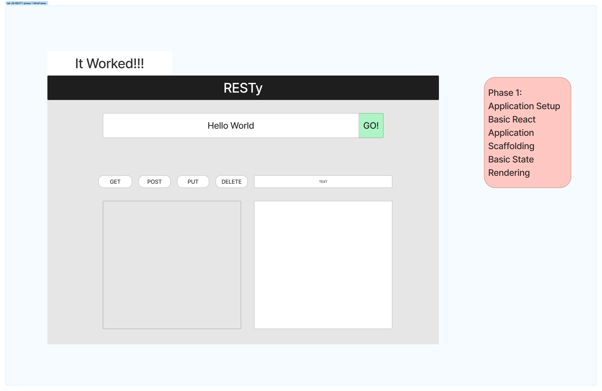

# RESTy

A browser based API testing tool, Refactor the application to use this.setState to implement the useState react API hook.

In phase 2, we will be receiving user input in preparation of connecting to live APIs, using the useState() hook in our functional components. In order to properly manage state with the useState hook, we will now convert App.js to a functional component.

In phase 3, we integrated the live APIs the input box takes in a users input and the URL to what ever API of their choice and once they click go. The application will show JSON data from that api. With the use of useEffect. 

## Collaborators

Stephen Martinez

## Business Requirements

Our application will be an API testing tool that can be run in any browser, allowing a user to easily interact with APIs in a familiar interface.

<!-- To Be filled in by you the student as we iterate thru Module 6 Labs -->

## Setup

- npx create-react-app resty
- npm i  <!-- bring in demo code/src folder -->
- push to github
  - git remote add origin <https://github.com/Junyoungson808/resty.git>

## Technical Requirements

The following user stories detail the major functionality for this phase of the project.

As a user, I want to enter the REST Method and URL to an API
As a user, I want to see a summary of my request as well as results returned from an API request in my browser in a readable format
Application Flow:

User enters an API URL
Chooses a REST Method
Clicks the “Go” button
Application fetches data from the URL given, with the method specified
Displays the response headers and results separately
Both headers and results should be “pretty printed” JSON

Phase 3 Requirements
In phase 3, we will be connecting RESTy to live APIs, fetching and displaying remote data. Our primary focus will be to service GET requests

The following user stories detail the major functionality for this phase of the project.

As a user, I want to enter the URL to an API and issue a GET request so that I can retrieve it’s data
As a user, I want to see the results returned from an API request in my browser in a readable format
Application Flow:

User enters an API URL
Chooses a REST Method
Clicks the “Go” button
Application fetches data from the URL given, with the method specified
Displays the response headers and results separately
Both headers and results should be “pretty printed” JSON

## 

## 

## 

## [Sandbox](https://codesandbox.io/p/github/Junyoungson808/resty/effectHook?file=%2Fpackage-lock.json&workspace=%257B%2522activeFileId%2522%253A%2522cl9ndv63g0002lqeb1ca1abe0%2522%252C%2522openFiles%2522%253A%255B%255D%252C%2522sidebarPanel%2522%253A%2522EXPLORER%2522%252C%2522gitSidebarPanel%2522%253A%2522COMMIT%2522%252C%2522sidekickItems%2522%253A%255B%257B%2522type%2522%253A%2522PREVIEW%2522%252C%2522taskId%2522%253A%2522start%2522%252C%2522port%2522%253A3000%252C%2522key%2522%253A%2522cl9q9t34b00eo356i2z98pts8%2522%252C%2522isMinimized%2522%253Afalse%257D%255D%257D)

## [Sandbox](https://codesandbox.io/p/github/Junyoungson808/resty/phase1.1?file=%2Fpackage-lock.json&selection=%5B%7B%22endColumn%22%3A24%2C%22endLineNumber%22%3A8%2C%22startColumn%22%3A24%2C%22startLineNumber%22%3A8%7D%5D&workspace=%257B%2522activeFileId%2522%253A%2522cl9ndv63g0002lqeb1ca1abe0%2522%252C%2522openFiles%2522%253A%255B%255D%252C%2522sidebarPanel%2522%253A%2522EXPLORER%2522%252C%2522gitSidebarPanel%2522%253A%2522COMMIT%2522%252C%2522sidekickItems%2522%253A%255B%257B%2522type%2522%253A%2522PREVIEW%2522%252C%2522taskId%2522%253A%2522start%2522%252C%2522port%2522%253A3000%252C%2522key%2522%253A%2522cl9nk0zff006b356i9kie9zkp%2522%252C%2522isMinimized%2522%253Afalse%257D%255D%257D)

## Blockers

- Running tests on my project seem to all be broken or have errors. Was not able to find a solution yet. Once I find the solution will fix. -10/25/2022

- No Blockers, completed the tests and fixed the previous blocker. input is now working properly and can take in different URL's and display data from the different API's.
